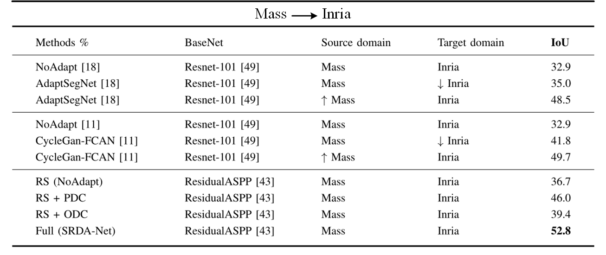

# SRDA-Net: Super-Resolution Domain Adaptation Networks for Semantic Segmentation
Pytorch implementation of our method for adapting semantic segmentation 
from the low-resolution remote sensing dataset (source domain) to the high-resolution remote sensing dataset.

Contact: Zhenjie Tang (tangzhenjie.hebut@gmail.com) and Bin Pan (panbin@nankai.edu.cn)

## paper
[SRDA-Net: Super-Resolution Domain Adaptation Networks for Semantic Segmentation]() <br />
[Enhai Liu](), [Zhenjie Tang](), [Bin Pan]()\*, [Xia Xu](), [Tianyang Shi](), [Zhenwei Shi]()

Please cite our paper if you find it useful for your research.

## Example Results


## Quantitative Reuslts



## Installation
* Install Pytorch 1.3.0 from http://pytorch.org with python 3.6 and CUDA 10.1

* Clone this repo
```
git clone https://github.com/tangzhenjie/SRDA-Net
cd SRDA-Net
```
## Dataset
* Download the [Massachusetts Buildings Dataset](https://www.cs.toronto.edu/~vmnih/data/) 
 Training Set as the source domain, and put it `./datasets` folder
 
 * Download the [Inria Aerial Image Labeling Dataset](https://project.inria.fr/aerialimagelabeling/)
 as the target domain, and put it to `./datasets` folder.
 
