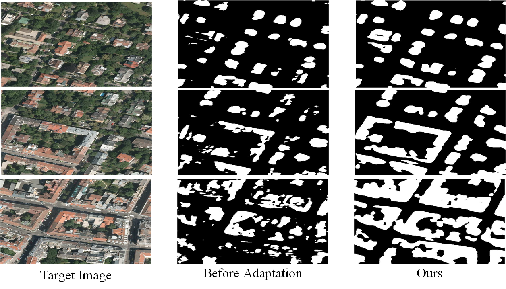

# SRDA-Net: Super-Resolution Domain Adaptation Networks for Semantic Segmentation
Pytorch implementation of our method for adapting semantic segmentation 
from the low-resolution remote sensing dataset (source domain) to the high-resolution remote sensing dataset.

Contact: Zhenjie Tang (tangzhenjie.hebut@gmail.com) and Bin Pan (panbin@nankai.edu.cn)

##paper
[SRDA-Net: Super-Resolution Domain Adaptation Networks for Semantic Segmentation]()  
[Enhai Liu](), [Zhenjie Tang](), [Bin Pan]()\*, [Xia Xu](), [Tianyang Shi](), [Zhenwei Shi]()

Please cite our paper if you find it useful for your research.

## Example Results

## Quantitative Reuslts

